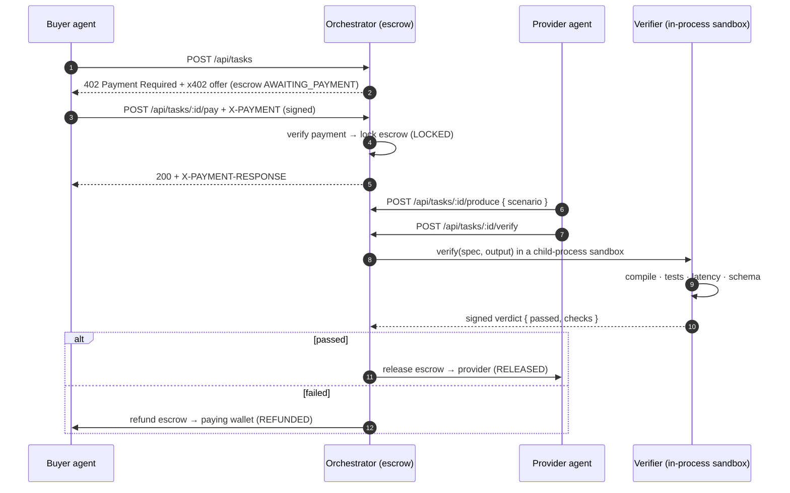

<div align="center">

<h1> TOKENPACT</h1>

### Don't pay for promises. **Pay for proof.**

Reverse escrow + quality-gated settlement for autonomous AI agents, built on [**x402**](https://x402.org).

[](./LICENSE)
[](https://nodejs.org)
[](https://pnpm.io)
[](https://www.typescriptlang.org)
[](https://x402.org)
[](#roadmap)

<samp>x402 × AI AGENTS × MACHINE-VERIFIABLE QUALITY</samp>

</div>

---

```text
   TASK SPEC  →  ESCROW  →  OUTPUT  →  VERIFICATION  →  SETTLEMENT
                                            │
                                  PASS ──────┴────── FAIL
                          release to provider     refund to buyer
```

**TokenPact** is an autonomous, quality-gated payment layer for AI agents. A buyer
agent posts a task with a *machine-checkable* quality spec; the reward is locked
in escrow over x402; a provider agent produces the output; an **independent
verifier** runs the checks in a sandbox; and payment settles **only on proof** —
released to the provider on PASS, refunded to the buyer on FAIL. No human reviews
either outcome.

> Today, agents pay first and trust comes later. TokenPact flips it: the money
> moves last, and only when the work is provably correct.

## Table of contents

- [The problem](#the-problem)
- [The insight](#the-insight)
- [What TokenPact does](#what-tokenpact-does)
- [How verification works](#how-verification-works)
- [Architecture](#architecture)
- [Why x402](#why-x402)
- [Quickstart](#quickstart)
- [Repository layout](#repository-layout)
- [API](#api)
- [Configuration](#configuration)
- [Roadmap](#roadmap)
- [Tech stack](#tech-stack)
- [Why this is different](#why-this-is-different)
- [Contributing](#contributing)
- [Security](#security)
- [Team](#team)
- [License](#license)

## The problem

AI agents are starting to buy services from other agents and APIs — and paying
for them automatically. But **payment proves delivery, not quality.**

- Bad outputs still get paid.
- Agents can't reliably judge every service they buy.
- Autonomous transactions need machine-verifiable trust, not vibes.

An agent pays an API, gets an output back, and has no dependable way to answer
the only question that matters: *is it actually correct?*

## The insight

The traditional flow is **pay → receive → hope.** The hope step doesn't scale to
machines transacting thousands of times a second.

> **What if payment were conditional?**

Make the money contingent on a test the machine can run itself.

## What TokenPact does

TokenPact is **reverse escrow for AI agents**. Four roles, one loop:

| # | Role | Does |
| - | --- | --- |
| 01 | **Buyer agent** | Creates the task + a machine-checkable quality spec |
| 02 | **Provider** | Produces the output |
| 03 | **Verifier agent** | Runs a machine-checkable evaluation in a sandbox |
| 04 | **Settlement** | x402 releases funds on PASS, or returns them on FAIL |

```
PASS → release payment to provider        FAIL → reject · retry · dispute
```

The buyer funds escrow up front, but the provider is paid **only if** the
verifier confirms the output meets the spec. Failed work isn't paid by default.

## How verification works

If it can't be checked by a machine, it can't gate a payment. A spec pairs a
plain-language ask with a list of checks — and **all of them must pass**.

```jsonc
// the demo spec, authored by the buyer — packages/core/src/scenarios.ts
{
  "title": "Primality check",
  "task": "Implement isPrime(n): return true iff n is a prime number.",
  "fn": "isPrime",
  "tests": [ /* 12 cases: [1]→false, [2]→true, … [97]→true, [100]→false */ ],
  "acceptIf": {
    "compiles": true,
    "testsMustAllPass": true,   // all 12 must pass
    "p95BudgetMs": 50,          // p95 latency under 50ms
    "schema": "boolean"         // output must be a boolean
  },
  "priceCents": 8               // $0.08 reward, held in escrow
}
```

That's the predicate `compiles && tests_pass && p95 < 50ms && schema_match`,
expressed as data the verifier executes deterministically against the provider's
*actual* code:

```text
VERIFIER PIPELINE                RUNNING
code compiles          ────────  ✓ ok
unit tests             ────────  ✓ 12/12
runtime threshold      ────────  ✓ p95 < 50ms
output schema          ────────  ✓ boolean
                                 ───────────────
                                 PASS → payment released
```

The three demo providers make the gate bite: the **honest** √n solution passes
all four checks and is paid; the **faulty** "every odd number is prime" solution
fails 5 of 12 tests; the **slow** O(n) solution passes every test but blows the
p95 budget. Two of the three end in a refund — that's the point.

Full details — every check kind, the verdict format, and how to add your own —
live in [`docs/verification-spec.md`](./docs/verification-spec.md).

## Architecture

TokenPact is organized into three planes. Data flows left to right; **money only
moves at the end, and only on proof.**



**Key invariant:** the **verifier is never paid by the provider.** The party
judging the work has no stake in passing bad output — that's what makes the
verdict trustworthy. See [`docs/architecture.md`](./docs/architecture.md) for the
three-plane model, the escrow state machine, and the settlement design.

## Why x402

[x402](https://x402.org) is an open protocol that puts payment directly on the
HTTP request path using the `402 Payment Required` status code. A server replies
`402` with machine-readable payment requirements; the agent pays a stablecoin
micropayment (e.g. USDC on Base) and retries with an `X-PAYMENT` header; a
**facilitator** verifies and settles it.

That's exactly the rail agents need — **no cards, no invoices, no human in the
loop.** Agents pay per request, in cents, without accounts. TokenPact adds the
missing half: rather than settling on the spot, it holds the payment in escrow
and settles **conditionally**, after the verifier signs off.

## Quickstart

### Prerequisites

- **Node.js ≥ 22.6** — the demo runs TypeScript sources directly via Node's
  built-in type-stripping (no build, no install needed for the offline demo).
- **pnpm ≥ 9** *(optional)* — `corepack enable && corepack prepare pnpm@latest --activate`.
  Only needed for the `pnpm …` script aliases; everything also runs with bare `node`.

> The end-to-end demo runs **fully offline** — no Docker, no wallet, no testnet
> funds. x402 settlement is *simulated* (real Ed25519-signed payment
> authorizations, but no live chain or facilitator). A live rail is on the
> [roadmap](#roadmap).

### Run the demo

The fastest way to see the whole loop settle three ways — released, and refunded
two different ways — is the end-to-end smoke run. **Zero install:**

```bash
git clone https://github.com/<your-org>/tokenpact.git
cd tokenpact

npm install -g .

tokenpact smoke
```

To drive it through the live HTTP surface + dashboard instead, start the
orchestrator and open the browser demo:

```bash
tokenpact server
tokenpact buyer               
tokenpact provider honest     
```

With our **Global CLI**, starting the entire ecosystem is just one command away:

```bash
npm install -g tokenpact-cli

tokenpact
```
This automatically boots up the Orchestrator (on port 8402) and spawns the Buyer and Provider agents simultaneously. 

You can also run specific components:
```bash
tokenpact smoke
tokenpact server             
tokenpact buyer             
tokenpact provider honest   
```

Choose the **faulty** or **slow** provider and the task settles as **REFUNDED** —
the provider gets `$0` and the paying wallet is made whole. That's the whole point.

> **What's real vs. simulated:** verification is real (the sandbox executes the
> provider's actual code and the pass/fail gate is genuine), and payment
> authorizations are really Ed25519-signed and verified. Only the settlement
> *transfer* is simulated — no funds move on a live chain. See the
> [roadmap](#roadmap) for the on-chain path and the Docker-isolated sandbox.

## Repository layout

```
tokenpact/
├── apps/
│   ├── orchestrator/     # Escrow state machine + x402 settlement + HTTP API
│   │   ├── src/          #   server.ts · store.ts (ledger.json) · x402.ts
│   │   ├── public/       #   the browser dashboard (index.html · app.js · styles.css)
│   │   └── scripts/      #   smoke.ts — the asserting end-to-end demo
│   └── verifier/         # Cloud Verification client: compile · tests · latency · schema
├── agents/
│   ├── buyer/            # Example buyer agent (premium ASCII CLI + x402 payment)
│   └── provider/         # Example provider agent (honest · faulty · slow)
├── contracts/            # Smart Contract Prototypes (TokenPactEscrow.sol)
├── packages/
│   └── core/             # Shared types, task spec + demo scenarios, x402 primitives
├── tools/                # ts-run.mjs / ts-resolve.mjs — run TS sources, zero build
├── docs/                 # Architecture · verification spec · structure guide
└── .github/              # CI + templates
```

Managed as a **pnpm workspace**. Shared code lives in `@tokenpact/core` and is
consumed via `workspace:*`. The verifier relies on the **Piston API** to securely execute code in cloud sandboxes across 50+ programming languages.

## API

**Orchestrator** (`:8402`) — the escrow state machine, the x402 handshake, and
the settlement coordinator. It also serves the dashboard at `/`.

| Method | Route | Purpose |
| --- | --- | --- |
| `POST` | `/api/tasks` | Author a task from the demo spec → **`402 Payment Required`** with the x402 offer (escrow `AWAITING_PAYMENT`) |
| `POST` | `/api/tasks/:id/pay` | Submit the signed `X-PAYMENT` → verify + lock escrow (`LOCKED`); replies `200` + `X-PAYMENT-RESPONSE` |
| `POST` | `/api/tasks/:id/produce` | Provider produces an output for a `{ scenario }` (`honest` \| `faulty` \| `slow`) |
| `POST` | `/api/tasks/:id/verify` | Run the sandboxed checks → settle: `RELEASED` on PASS, `REFUNDED` on FAIL |
| `GET`  | `/api/tasks/:id` | Inspect one transaction's escrow state + record |
| `GET`  | `/api/state` | Demo spec, provider scenarios, addresses, ledger, and running stats |
| `GET`  | `/api/ledger` | The full settlement ledger |

The **verifier** is not a network service — it's an in-process library
(`apps/verifier`) the orchestrator calls during `/verify`, running the provider's
code in a child-process sandbox and returning a signed `VerificationResult`.

## Configuration

The offline demo needs **no configuration** — it runs with zero env vars. The
variables below are for the *planned* live-rail path (real facilitator, wallets,
persistent ledger); set them via `.env` (see [`.env.example`](./.env.example)).
Only `ORCHESTRATOR_PORT` affects the demo today.

| Variable | Default | Description |
| --- | --- | --- |
| `ORCHESTRATOR_PORT` | `8402` | Orchestrator HTTP port (the only var the demo reads) |
| `SANDBOX_DRIVER` | `docker` | *Planned* isolation backend: `docker` \| `firecracker` \| `none` |
| `SANDBOX_TIMEOUT_MS` | `10000` | Hard wall-clock limit per verification run |
| `X402_NETWORK` | `base-sepolia` | *Planned* settlement network: `base-sepolia` \| `base` |
| `X402_FACILITATOR_URL` | `https://x402.org/facilitator` | *Planned* facilitator that verifies + settles x402 payments |
| `X402_ASSET` | `USDC` | *Planned* settlement asset |
| `BUYER_PRIVATE_KEY` | — | *Planned* — funds escrow on a live rail *(testnet/burner keys only)* |
| `DATABASE_URL` | `file:./data/tokenpact.sqlite` | *Planned* persistent transaction log |

> ⚠️ Use **testnet keys and burner wallets** in development. Never commit a real
> `.env`; it's already git-ignored.

## Roadmap

**Running today** (fully offline, settlement simulated)

- [x] Typed task spec with an extensible, machine-checkable acceptance model
- [x] Escrow state machine `AWAITING_PAYMENT → LOCKED → RELEASED / REFUNDED` with settlement-safe transitions
- [x] x402 handshake: `402` offer → signed `X-PAYMENT` → verify → lock (real ECDSA sigs)
- [x] Universal Cloud Verification (Piston API sandbox) supporting 50+ languages + network latency checks
- [x] Persistent JSON Transaction Ledger with UI Visualizer
- [x] **Metered access** — API Tollbooth with x402 micropayments
- [x] End-to-end demo: browser dashboard, premium ASCII CLI agents, and an asserting smoke run

- [x] Smart Contract Prototype (`TokenPactEscrow.sol`) for on-chain proof

**Future Roadmap**

- Live x402 settlement — deploying the contract to Base Sepolia
- Multiple independent verifiers over the signed attestations (quorum / staking)

### Second surface — the tollbooth

The same escrow + metering + settlement machinery can gate any expensive
downstream API: charge per call, settle x402 micropayments automatically, track
usage, and enforce per-agent budgets. **One payment layer, two agent economies.**

## Tech stack

| Layer | Today | Prototype / planned |
| --- | --- | --- |
| **Agent** | TypeScript buyer/provider agents over HTTP with premium ASCII CLI | — |
| **Verification** | Piston API Cloud Sandbox (Supports 50+ languages, real execution) | Multiple decentralized verifiers |
| **Payments** | x402 handshake, ECDSA-signed authorizations, Solidity contract prototype | Deployed on-chain escrow + live facilitator |
| **State** | Persistent file-system ledger (`ledger.json`) + balances | On-chain log + indexer |

Runtime: **Node.js ≥ 22.6 + TypeScript (strict)**, **pnpm** workspaces. The demo
server uses Node's built-in `http` — no framework — and runs TypeScript sources
directly via Node's type-stripping loader (`tools/ts-run.mjs`), so the offline
demo needs no build and no dependency install. The live x402 rail plugs in at the
settlement boundary.

## Why this is different

TokenPact is **not another AI agent.** A generic agent generates output, calls
tools, and uses APIs. TokenPact is the **infrastructure** underneath an economy
where those agents transact:

- Agents hire agents — and payments settle automatically.
- Outputs are machine-verified, so failed work isn't paid by default.
- Usage can be metered, and transactions run unsupervised.

It's plumbing for an economy where AI agents buy and sell services **without a
human approving every payment.**

## Contributing

Contributions, issues, and ideas are welcome — see
[`CONTRIBUTING.md`](./CONTRIBUTING.md) and our
[`CODE_OF_CONDUCT.md`](./CODE_OF_CONDUCT.md). In short:

```bash
pnpm install
pnpm typecheck && pnpm lint && pnpm test
```

Branch from `main`, keep PRs focused, and use
[Conventional Commits](https://www.conventionalcommits.org/).

## Security

TokenPact moves money and runs untrusted code. Please read
[`SECURITY.md`](./SECURITY.md) before touching the payment or verifier paths.
Never commit secrets; always run the verifier inside a sandbox; the verifier is
never funded by the provider.

## Team

**Team TechCrunch**

- **Anwesha Mondal**
- **Dev Krrish Sinha**
- **Pushkar Kumar**

## License

[MIT](./LICENSE) © 2026 TokenPact — Team TechCrunch.

---

<div align="center">
<sub><strong>REVERSE ESCROW × x402 × AUTONOMOUS AGENTS</strong></sub><br>
<sub>Don't pay for promises. Pay for proof.</sub>
</div>
