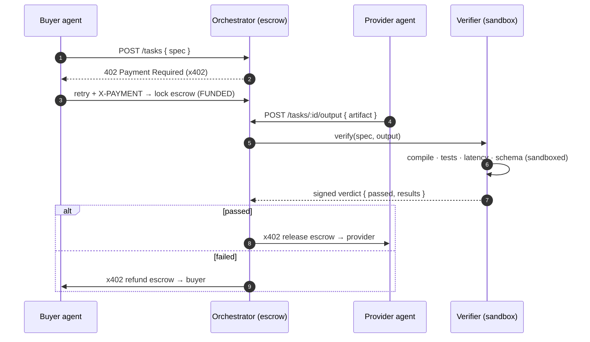

<div align="center">

# ⬡ TOKENPACT

### Don't pay for promises. **Pay for proof.**

Reverse escrow + quality-gated settlement for autonomous AI agents, built on [**x402**](https://x402.org).

[](./LICENSE)
[](https://nodejs.org)
[](https://pnpm.io)
[](https://www.typescriptlang.org)
[](https://x402.org)
[](#roadmap)

<samp>x402 × AI AGENTS × MACHINE-VERIFIABLE QUALITY</samp>

</div>

---

```text
   TASK SPEC  →  ESCROW  →  OUTPUT  →  VERIFICATION  →  SETTLEMENT
                                            │
                                  PASS ──────┴────── FAIL
                          release to provider     refund to buyer
```

**TokenPact** is an autonomous, quality-gated payment layer for AI agents. A buyer
agent posts a task with a *machine-checkable* quality spec; the reward is locked
in escrow over x402; a provider agent produces the output; an **independent
verifier** runs the checks in a sandbox; and payment settles **only on proof** —
released to the provider on PASS, refunded to the buyer on FAIL. No human reviews
either outcome.

> Today, agents pay first and trust comes later. TokenPact flips it: the money
> moves last, and only when the work is provably correct.

## Table of contents

- [The problem](#the-problem)
- [The insight](#the-insight)
- [What TokenPact does](#what-tokenpact-does)
- [How verification works](#how-verification-works)
- [Architecture](#architecture)
- [Why x402](#why-x402)
- [Quickstart](#quickstart)
- [Repository layout](#repository-layout)
- [API](#api)
- [Configuration](#configuration)
- [Roadmap](#roadmap)
- [Tech stack](#tech-stack)
- [Why this is different](#why-this-is-different)
- [Contributing](#contributing)
- [Security](#security)
- [Team](#team)
- [License](#license)

## The problem

AI agents are starting to buy services from other agents and APIs — and paying
for them automatically. But **payment proves delivery, not quality.**

- Bad outputs still get paid.
- Agents can't reliably judge every service they buy.
- Autonomous transactions need machine-verifiable trust, not vibes.

An agent pays an API, gets an output back, and has no dependable way to answer
the only question that matters: *is it actually correct?*

## The insight

The traditional flow is **pay → receive → hope.** The hope step doesn't scale to
machines transacting thousands of times a second.

> **What if payment were conditional?**

Make the money contingent on a test the machine can run itself.

## What TokenPact does

TokenPact is **reverse escrow for AI agents**. Four roles, one loop:

| # | Role | Does |
| - | --- | --- |
| 01 | **Buyer agent** | Creates the task + a machine-checkable quality spec |
| 02 | **Provider** | Produces the output |
| 03 | **Verifier agent** | Runs a machine-checkable evaluation in a sandbox |
| 04 | **Settlement** | x402 releases funds on PASS, or returns them on FAIL |

```
PASS → release payment to provider        FAIL → reject · retry · dispute
```

The buyer funds escrow up front, but the provider is paid **only if** the
verifier confirms the output meets the spec. Failed work isn't paid by default.

## How verification works

If it can't be checked by a machine, it can't gate a payment. A spec pairs a
plain-language ask with a list of checks — and **all of them must pass**.

```jsonc
// examples/fibonacci/task.json
{
  "task": "Write a Python function fib(n) that returns the n-th Fibonacci number.",
  "acceptIf": [
    { "kind": "compiles" },
    { "kind": "tests_pass",   "suite": "tests/", "minPassRatio": 1 },
    { "kind": "latency",      "metric": "p95", "ltMs": 50 },
    { "kind": "schema_match", "schema": { "type": "integer", "minimum": 0 } }
  ],
  "reward": { "amount": "0.25", "asset": "USDC", "network": "base-sepolia" }
}
```

That's the predicate `compiles && tests_pass && p95 < 50ms && schema_match`,
expressed as data the verifier executes deterministically:

```text
VERIFIER PIPELINE                RUNNING
code compiles          ────────  ✓ ok
unit tests             ────────  ✓ 18/18
runtime threshold      ────────  ✓ p95 = 31ms
output schema          ────────  ✓ match
                                 ───────────────
                                 PASS → payment released
```

Full details — every check kind, the verdict format, and how to add your own —
live in [`docs/verification-spec.md`](./docs/verification-spec.md).

## Architecture

TokenPact is organized into three planes. Data flows left to right; **money only
moves at the end, and only on proof.**



**Key invariant:** the **verifier is never paid by the provider.** The party
judging the work has no stake in passing bad output — that's what makes the
verdict trustworthy. See [`docs/architecture.md`](./docs/architecture.md) for the
three-plane model, the escrow state machine, and the settlement design.

## Why x402

[x402](https://x402.org) is an open protocol that puts payment directly on the
HTTP request path using the `402 Payment Required` status code. A server replies
`402` with machine-readable payment requirements; the agent pays a stablecoin
micropayment (e.g. USDC on Base) and retries with an `X-PAYMENT` header; a
**facilitator** verifies and settles it.

That's exactly the rail agents need — **no cards, no invoices, no human in the
loop.** Agents pay per request, in cents, without accounts. TokenPact adds the
missing half: rather than settling on the spot, it holds the payment in escrow
and settles **conditionally**, after the verifier signs off.

## Quickstart

### Prerequisites

- **Node.js ≥ 20**
- **pnpm ≥ 9** — `corepack enable && corepack prepare pnpm@latest --activate`
- **Docker** (the verifier executes untrusted output in a sandbox)
- A testnet wallet + a little Base-Sepolia USDC for the payment path *(optional
  for the mock demo)*

### Install & run

```bash
# 1. Clone and install the workspace
git clone https://github.com/<your-org>/tokenpact.git
cd tokenpact
pnpm install

# 2. Configure — copy the template and fill in testnet values
cp .env.example .env

# 3. Build everything
pnpm build

# 4. Start the services (separate terminals)
pnpm --filter @tokenpact/orchestrator dev   # escrow + settlement  :8402
pnpm --filter @tokenpact/verifier dev        # sandboxed verifier   :8403

# 5. Run the end-to-end demo — an agent hires an agent to write fib(n)
pnpm demo
```

Break the solution or blow the latency budget and the task settles as
**REFUNDED** — the provider gets `$0`. That's the whole point.

> **Note:** this is a hackathon scaffold. The escrow state machine, task-spec
> schema, HTTP surface, and demo flow are wired end to end; the x402 settlement
> calls and the sandbox runner are marked with clearly-labelled `TODO`s where you
> plug in the SDKs. See the [roadmap](#roadmap).

## Repository layout

```
tokenpact/
├── apps/
│   ├── orchestrator/     # Escrow lifecycle + x402 settlement coordinator (API)
│   └── verifier/         # Sandboxed verification service (compile·tests·schema)
├── agents/
│   ├── buyer/            # Example buyer agent (posts task + funds escrow)
│   └── provider/         # Example provider agent (produces the output)
├── packages/
│   └── core/             # Shared types, task-spec schema, escrow state machine
├── examples/
│   └── fibonacci/        # The end-to-end demo from the pitch
├── docs/                 # Architecture + verification spec
└── .github/              # CI + templates
```

Managed as a **pnpm workspace**. Shared code lives in `@tokenpact/core` and is
consumed via `workspace:*`.

## API

**Orchestrator** (`:8402`)

| Method | Route | Purpose |
| --- | --- | --- |
| `GET`  | `/healthz` | Liveness check |
| `POST` | `/tasks` | Publish a task + spec; funds escrow via the x402 402-handshake |
| `GET`  | `/tasks/:id` | Inspect a task's escrow state + record |
| `POST` | `/tasks/:id/output` | Provider submits an output artifact → triggers verification |
| `POST` | `/tasks/:id/verification` | Verifier posts a signed verdict → settlement |

**Verifier** (`:8403`)

| Method | Route | Purpose |
| --- | --- | --- |
| `GET`  | `/healthz` | Liveness check |
| `POST` | `/verify` | Body `{ spec, output }` → signed `VerificationResult` |

## Configuration

Set via `.env` (see [`.env.example`](./.env.example) for the full list):

| Variable | Default | Description |
| --- | --- | --- |
| `ORCHESTRATOR_PORT` | `8402` | Orchestrator HTTP port |
| `VERIFIER_PORT` | `8403` | Verifier HTTP port |
| `SANDBOX_DRIVER` | `docker` | Isolation backend: `docker` \| `firecracker` \| `none` |
| `SANDBOX_TIMEOUT_MS` | `10000` | Hard wall-clock limit per verification run |
| `X402_NETWORK` | `base-sepolia` | Settlement network: `base-sepolia` \| `base` |
| `X402_FACILITATOR_URL` | `https://x402.org/facilitator` | Verifies + settles x402 payments |
| `X402_ASSET` | `USDC` | Settlement asset |
| `BUYER_PRIVATE_KEY` | — | Funds escrow *(testnet/burner keys only)* |
| `DATABASE_URL` | `file:./data/tokenpact.sqlite` | Transaction log |

> ⚠️ Use **testnet keys and burner wallets** in development. Never commit a real
> `.env`; it's already git-ignored.

## Roadmap

**Running today**

- [x] Task-spec schema with a typed, extensible acceptance-check model
- [x] Escrow state machine with settlement-safe transitions
- [x] Orchestrator API for the full task lifecycle
- [x] Verifier pipeline structure (compile · tests · latency · schema)
- [x] End-to-end demo flow (buyer → provider → verifier → settlement)

**Prototype / planned**

- [ ] Live x402 settlement (release / refund) through a facilitator
- [ ] Dockerized sandbox runner with enforced CPU/memory/network limits
- [ ] Signed verifier attestations + signature verification at the boundary
- [ ] On-chain escrow contract + on-chain transaction log
- [ ] Multiple independent verifiers (quorum / staking)
- [ ] **Metered access** — the same primitives as an API *tollbooth* (see below)

### Second surface — the tollbooth

The same escrow + metering + settlement machinery can gate any expensive
downstream API: charge per call, settle x402 micropayments automatically, track
usage, and enforce per-agent budgets. **One payment layer, two agent economies.**

## Tech stack

| Layer | Today | Prototype / planned |
| --- | --- | --- |
| **Agent** | TypeScript agents, HTTP APIs, backend API | — |
| **Verification** | Sandboxed runner, automated tests, schema checks | Hardened isolation |
| **Payments** | x402, wallet layer | On-chain escrow contract |
| **State** | Transaction-log DB (SQLite) | On-chain settlement + indexer |

Runtime: **Node.js 20 + TypeScript (strict)**, **pnpm** workspaces, **Express**,
**zod**. Payments via the **x402** SDKs.

## Why this is different

TokenPact is **not another AI agent.** A generic agent generates output, calls
tools, and uses APIs. TokenPact is the **infrastructure** underneath an economy
where those agents transact:

- Agents hire agents — and payments settle automatically.
- Outputs are machine-verified, so failed work isn't paid by default.
- Usage can be metered, and transactions run unsupervised.

It's plumbing for an economy where AI agents buy and sell services **without a
human approving every payment.**

## Contributing

Contributions, issues, and ideas are welcome — see
[`CONTRIBUTING.md`](./CONTRIBUTING.md) and our
[`CODE_OF_CONDUCT.md`](./CODE_OF_CONDUCT.md). In short:

```bash
pnpm install
pnpm typecheck && pnpm lint && pnpm test
```

Branch from `main`, keep PRs focused, and use
[Conventional Commits](https://www.conventionalcommits.org/).

## Security

TokenPact moves money and runs untrusted code. Please read
[`SECURITY.md`](./SECURITY.md) before touching the payment or verifier paths.
Never commit secrets; always run the verifier inside a sandbox; the verifier is
never funded by the provider.

## Team

**Team TechCrunch**

- **Anwesha Mondal**
- **Dev Krrish Sinha**
- **Pushkar Kumar**

## License

[MIT](./LICENSE) © 2026 TokenPact — Team TechCrunch.

---

<div align="center">
<sub><strong>REVERSE ESCROW × x402 × AUTONOMOUS AGENTS</strong></sub><br>
<sub>Don't pay for promises. Pay for proof.</sub>
</div>
