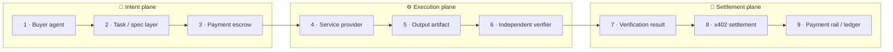
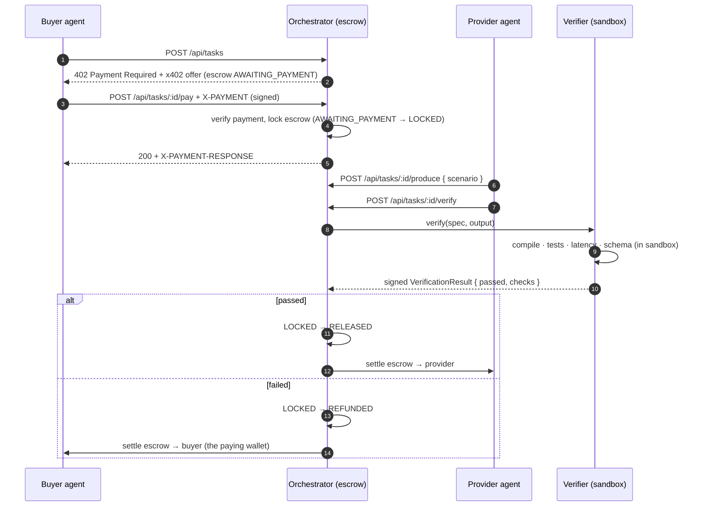
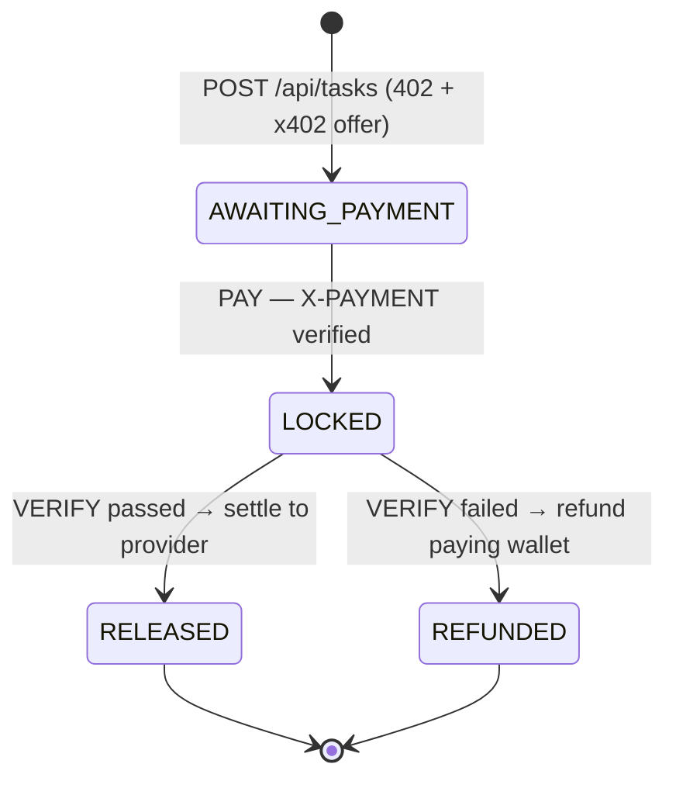

# Architecture

TokenPact is an **autonomous, quality-gated payment layer** for AI agents. It
sits between an agent that wants work done and an agent (or API) that does it,
and it guarantees one property that plain payments cannot:

> Payment is released **only** when the output provably meets the spec.

The system is organized into three planes. Data flows left to right; money only
moves at the very end, and only on proof.

**Invariant:** the verifier is **never paid by the provider**. It is an
independent party (or the buyer's own trusted checker). This separation is what
makes the verdict trustworthy — the entity judging the work has no incentive to
pass bad output.

## The core loop

## Components

| Component | Package | Responsibility |
| --- | --- | --- |
| **Orchestrator** | `apps/orchestrator` | Owns the escrow state machine, issues x402 payment requirements, coordinates verification, executes settlement, writes the transaction log. |
| **Verifier** | `apps/verifier` | Runs the acceptance checks from `spec.acceptIf` inside a sandbox and returns a signed PASS/FAIL verdict with per-check detail. |
| **Buyer agent** | `agents/buyer` | Composes a task + spec, funds escrow over x402, waits for settlement. |
| **Provider agent** | `agents/provider` | Produces an output artifact for a task. Paid only on proof. |
| **Core** | `packages/core` | Shared vocabulary: task-spec schema, domain types, escrow state machine. |

## Escrow state machine

The orchestrator can only move funds along the legal transitions of the
`EscrowState` type defined in `packages/core/src/types.ts`. There is exactly one
path to `RELEASED`, and it runs through a passing verification; every failure and
every guard violation routes the money back to the paying wallet as `REFUNDED`.

Escrow only locks once a payment authorization is verified (signature, amount,
offer match, expiry, and nonce replay all checked), and it can only settle once —
`produce` and `verify` are rejected until the escrow is `LOCKED`, and a settled
transaction cannot be settled again.

## Why x402

[x402](https://x402.org) is an open protocol that puts payments directly on the
HTTP request path using the long-reserved `402 Payment Required` status code. A
server answers a request with `402` plus machine-readable payment requirements;
the client pays (a stablecoin micropayment, e.g. USDC on Base) and retries with
an `X-PAYMENT` header; a **facilitator** verifies and settles the payment.

That gives TokenPact exactly the rail it needs:

- **No accounts, cards, or invoices** — agents pay per request, in cents.
- **No human in the loop** — settlement is programmatic.
- **A natural place to gate** — the same 402 handshake that funds escrow can be
  reused as a metered *tollbooth* for any expensive API (see the roadmap).

TokenPact adds the missing half: instead of settling on the spot, it holds the
payment in escrow and settles the x402 payment **conditionally**, after the
verifier signs off.

## Settlement: prototype vs. planned

| Concern | Prototype (today) | Planned |
| --- | --- | --- |
| Escrow custody | Orchestrator-controlled escrow account + in-memory/SQLite ledger | On-chain escrow contract |
| Settlement trigger | Orchestrator calls x402 release/refund after a signed verdict | Contract releases on a signed verifier attestation |
| Verifier trust | Single verifier, signature-checked | Multiple independent verifiers / staking |
| Transaction log | Local SQLite | On-chain event log + indexer |

## Second surface: the tollbooth

The same escrow-metering-settlement primitives can gate access to an expensive
downstream API: charge per call, settle x402 micropayments automatically, track
usage, and enforce per-agent budgets. Same machinery, a different gate — one
payment layer serving two agent economies.
